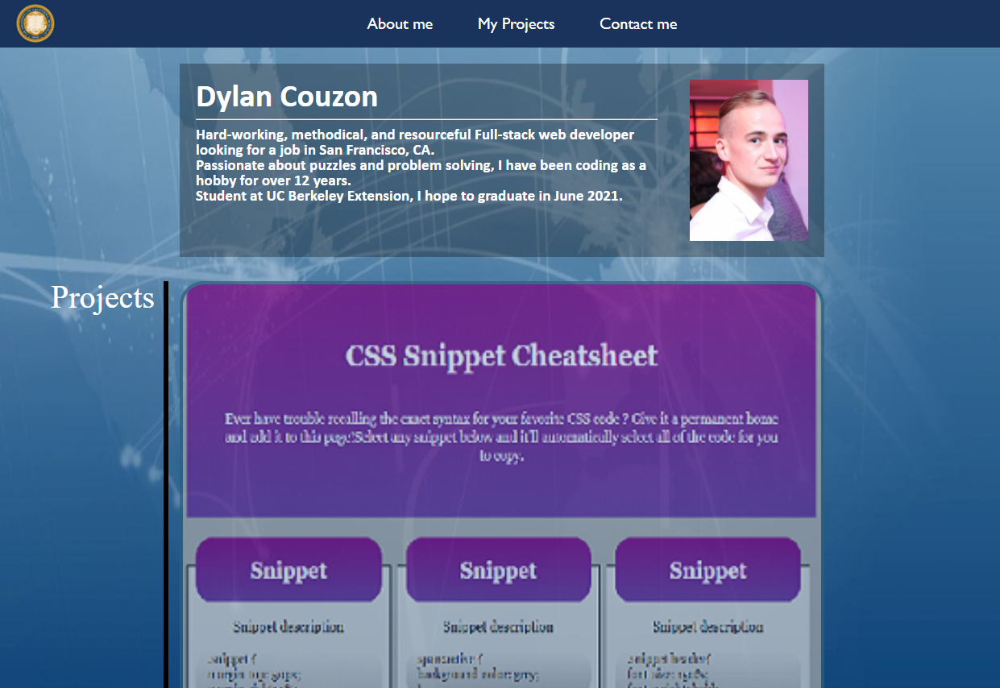

# Portfolio-1
Homework due 2021-3-23

## Technologies Used
- HTML - Creates text and differents elements 
- CSS - styles html elements on page
- GitHub - hosts and deploys the pages
- Bash - Terminal

## Summary 
This is my first Portfolio, it contains a description of myself, links to my previous projects and contact informations.
The Website is using a reset.css file as well a Flexbox to be compatible for every web browsers and Flebox

## Author Links
[LinkedIn](https://www.linkedin.com/in/dcouzon/)
[GitHub](https://github.com/Dylancouzon)
